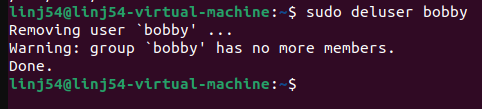
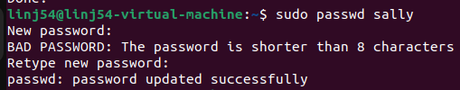
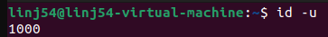
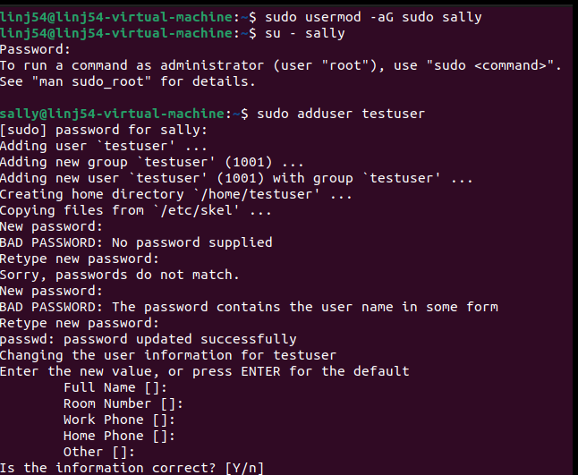
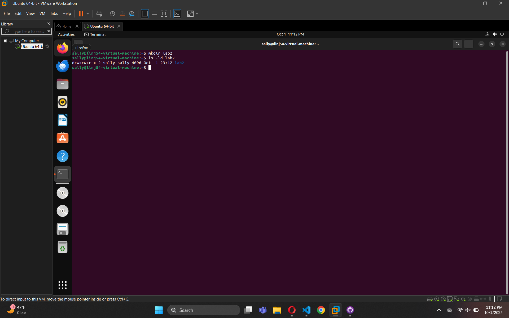
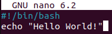
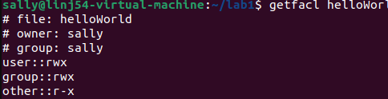
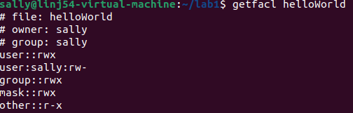

<div align="center">

# Linux Command Line Security Lab

## Cybersecurity Fundamentals

---

**School:** SUNY New Paltz  
**Author:** Jack Lin  
**Course:** CPS 493-02: Cybersecurity 748 – Fall 2025  
**Instructor:** Kailtlin Hoffman  
**Assignment:** Lab 1  
**Date:** October 2, 2025  
**GitHub Repository:** [Cybersecurity Labs](https://github.com/JLin-code/Cybersecurity)

</div>

<div style="page-break-after: always;"></div>

## System Updates and Maintenance

### 1. Check Available Updates
When you first ssh and open your virtual machine, you should be told how many updates that can be applied. Enter the command to list the updates available.

```bash
sudo apt list --upgradable
```


### 2. Update and Upgrade System
Update and Upgrade your system.

```bash
sudo apt update
sudo apt upgrade -y
```


### 3. System Reboot
Reboot your system. (You may have to wait a few minutes to ssh again).

```bash
sudo reboot
```

---

## User Tasks

### 4. Switch to Root User
Change the current user to root using the command sudo su root. What does the prompt look like?

```bash
sudo su root
```

**Answer:** Usually it changes from `ubuntu@machine:~$` to something like `root@machine:/home/ubuntu#`

### 5. User Creation Commands
Create a new user with the name bobby using the command useradd. Next, create another user with the name sally using the command adduser. What is the difference between the two?

```bash
sudo useradd bobby
sudo adduser sally
```

**Answer:** 
- `useradd` creates a low-level account with nothing else
- `adduser` creates a high-level account with homedir, environment, and password setup necessary


### 6. Switch to Sally User
Change the current user to sally. What does the prompt look like now?

```bash
su - sally
```

**Answer:** Changes the prompt to look like: `sally@lin52-virtual-machine:~$`

### 7. Permission Testing
While you're logged in as sally still, try to create a new user with the name earl. What happens? Why?

**Answer:** "sally is not in the sudoers file. This incident will be reported" appears due to the fact that sally does not have adequate permission since only root/sudo users can do that.

### 8. User Deletion
Enter exit until you are the original user, ubuntu, again. Delete the user earl. I didn't show you the command, but Google it! "Googling" skills are a great skill in CS; It's impossible to know everything.

```bash
sudo userdel bobby
```

**Note:** The user earl doesn't actually exist, but I deleted bobby instead.



### 9. Password Management
Change the password of sally to something you can remember using sudo passwd sally.

```bash
sudo passwd sally
```


### 10. Root User Security
For the rest of the tasks, use the ubuntu user. Even though it's easier to complete tasks/commands, why is it bad practice to stay logged in as root?

**Answer:** Staying as root is dangerous because any mistakes like `rm -rf /` could break the whole system, so it's better practice to work as a normal user and only use higher privilege when necessary.

### 11. User ID Check
Enter the command to see what your user id is.

```bash
id
```


---

## Group Tasks

### 12. Group Membership
What groups does ubuntu belong to?

**Groups and their purposes:**
- `adm` = logs
- `cdrom` = disc access  
- `sudo` = admin rights
- `dip` = network dial-up
- `plugdev` = USB devices
- `lpadmin` = printers
- `lxd` = containers
- `sambashare` = network file sharing

### 13. Sudo Access for Sally
Give sally the ability to execute sudo commands. Next, try to create a new user while logged in as sally.

```bash
sudo usermod -aG sudo sally
```


### 14-16. Group Management
- Create a new group called cybersec
- Add sally to the group, cybersec  
- Check to see which groups sally belongs

```bash
sudo groupadd cybersec
sudo usermod -aG cybersec sally
groups sally
```


---

## Permission and Access Control Lists

### 17. Directory Permissions
Create a new directory called lab1. Enter the command to find the permissions of the directory. Who is the owner and group owner of this directory? What permissions does the owner, group and other have?

```bash
mkdir lab1
ls -ld lab1
```

**Answer:**
- Owner has read, write, and execute permission  
- Group has read, write, and execute permission
- Other has read and execute permission



### 18. Bash Script Creation
Change your directory to lab1. Create a new bash file called, helloWorld. When ran, your program should just print "Hello World!". (Don't forget to make your bash file executable).

```bash
cd lab1
nano helloWorld
chmod +x helloWorld
```

**helloWorld script content:**
```bash
#!/bin/bash
echo "Hello World!"
```



**Execution:**
```bash
./helloWorld
```


### 19. File Permissions Analysis
Enter the command ls -la helloWorld. What are the reading, writing, and executing permissions for the owner, group and other?

a. Change the permissions so the group also has w and x permissions.

```bash
ls -la helloWorld
```

**Answer:**
- Owner has read, write, and execute permission  
- Group has read, write, and execute permission
- Other has read and execute permission

**Note:** Group already had w/x permissions

### 20. Access Control Lists (ACL)
Use the getfacl command to view the ACL of the file.

```bash
getfacl helloWorld
```


### 21. ACL Modification
Using the setfacl command, allow the user, sally, the ability to read and write to the file.

```bash
sudo setfacl -m u:sally:rw helloWorld
```

Using the setfacl command, allow the user, sally, the ability to read and write to the file.

```bash
sudo setfacl -m u:sally:rw helloWorld
```

