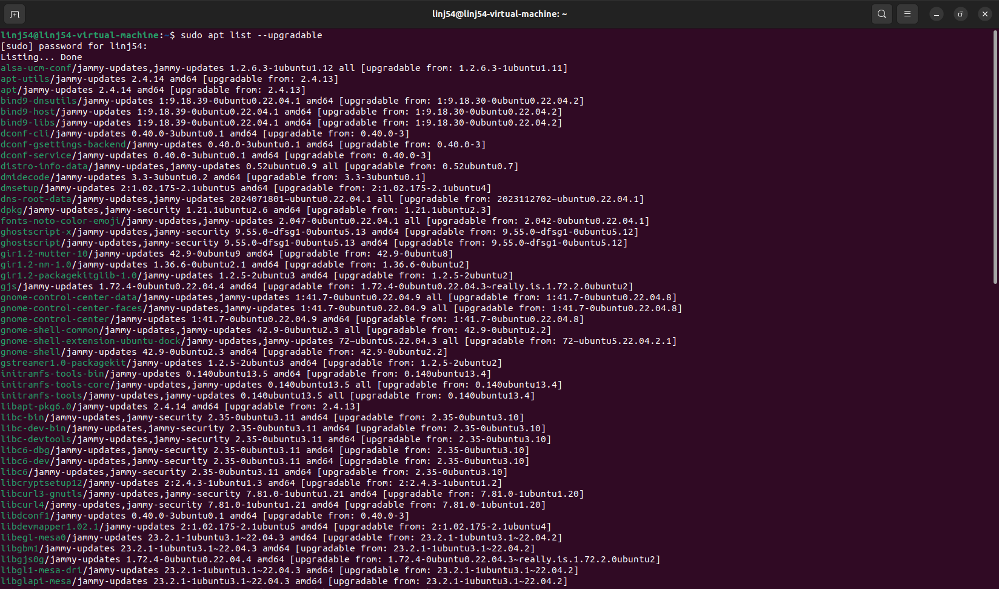
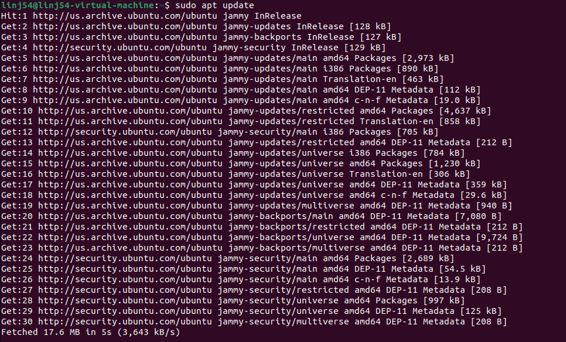
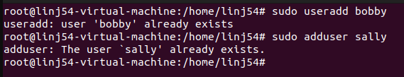

1. When you first ssh and open your virtual machine, you should be told
how many updates that can be applied. Enter the command to list the
updates available.

sudo apt list --upgradable

2. Update and Upgrade your system.

sudo apt update
sudo apt upgrade -y

3. Reboot your system. (You may have to wait a few minutes to ssh
again).

sudo reboot

User Tasks:
4. Change the current user to root using the command sudo su root.
What does the prompt look like?

sudo su root

Usually it changes from ubuntu@machine:~$ to something like root@machine:/home/ubuntu#

5. Create a new user with the name bobby using the command useradd.
Next, create another user with the name sally using the command
adduser. What is the difference between the two?

sudo useradd bobby
useradd creates a low-level account with nothing else

sudo adduser sally
adduser creates a high-level account with homedir, environment, and password setup neccsary

6. Change the current user to sally. What does the prompt look like now?

su - sally
Changes the prompty to look like: sally@machine:~$

7. While you’re logged in as sally still, try to create a new user with the
name earl. What happens? Why?

8. Enter exit until you are the original user, ubuntu, again. Delete the
user earl. I didn’t show you the command, but Google it! “Googling”
skills are a great skill in CS; It’s impossible to know everything.

9. Change the password of sally to something you can remember using
sudo passwd sally

10. For the rest of the tasks, use the ubuntu user. Even though it’s easier
to complete tasks/commands, why is it bad practice to stay logged in
as root?

11. Enter the command to see what your user id is.

Group Tasks:
12. What groups does ubuntu belong to?

13. Give sally the ability to execute sudo commands. Next, try to create a
new user while logged in as sally.

14. Create a new group called cybersec

15. Add sally to the group, cybersec

16. Check to see which groups sally belongs.
Permission and Access Control Lists:

17. Create a new directory called lab1. Enter the command to find the
permissions of the directory. Who is the owner and group owner of this
directory? What permissions does the owner, group and other have?

18. Change your directory to lab1. Create a new bash file called,
helloWorld. When ran, your program should just print “Hello World!”.
(Don’t forget to make your bash file executable).

19. Enter the command ls -la helloWorld. What are the reading, writing,
and executing permissions for the owner, group and other?
a. Change the permissions so the group also has w and x permissions.

20. Use the getfacl command to view the ACL of the file.

21. Using the setfacl command, allow the user, sally, the ability to read
and write to the file. 
